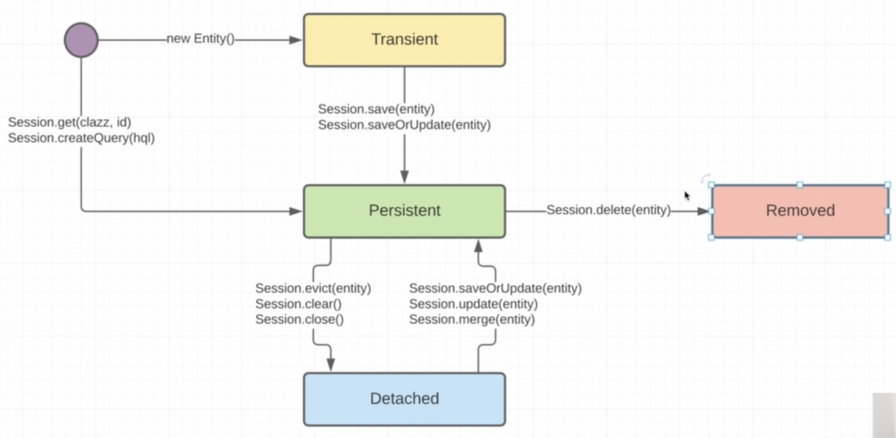

    1. Когда мы создали нашу сущность, она находится в Trasient
    2. Согласно схемы, как только мы соершили с ней некое деяние в памказ сессии, то сущность попадает в Pwrsistent
    (persistentContext = кэш первого уровня)
    3. Сущность находясь в persistent одной сессии может быть transient для другой сессии

refresh();

    user.setFirstname("Sveta");

    // тут наша сущность не с контексте еще нашей сесии, а значит хибер выполнит селект в БД и обновит user
    // до стояния user БД (имя Светы сотрется)
    session2.refresh(user);

merge();

    Наоборот refresh() - он перепишет в БД на то, что мы засетали юзеру

isDirty();

    Можем узнать, грязная ли у нас сессия (есть ли какие-то изменения у юзера повлекущие обновление в БД в результате,
    например setSmth(smth))