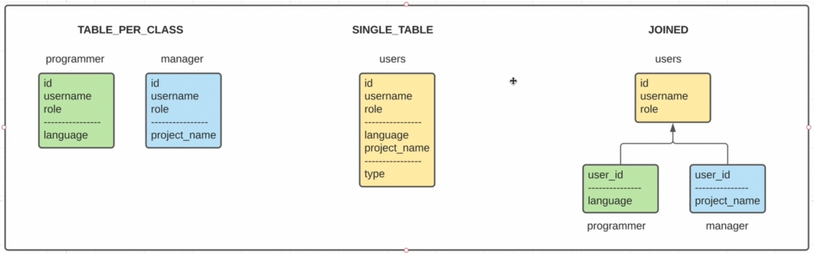

## Стратегии наследования

### TABLE_PER_CLASS

Смысл такой:
Базовая сущность не является сущностью БД и поля базовой сущности расписываются в разные таблицы (программист и менеджер) 
Над суперКлассом ставим @Inheritance(strategy = InheritanceType.TABLE_PER_CLASS). Класс делаем абстрактным, лучше еще
удалить @Table. Стратегия для ID теперь должна быть SEQUENCE (хибер сам создаст).
Если мы будем делать селект на базовый класс юзер, то хибер не будет знать, в какой таблице искать. ТОгда он в селект 
возьмет все поля общие + поле от программиста + поле от менеджера И + создаст поле clazz, каким он будет 
руководствоваться поняв в какой таблице запрашиваемая сущность.
Хибер сделает два запроса в разные таблицы и сделает юнионОлл по таблицам (поле программиста и поле менеджера он приведет 
к одному типу так, что юнион нормально сработает). Тут же будет поле clazz и хибер поймет, кого ему создать программиста 
или менеджера.
    
    Минусы:
    - дублируем общие поля в обоих таблицах
    - если мы хотим добавить отбщее поле, то мы должны править две таблицы
    - если мы делаем селект по базовому классу, то мы вынуждены делать юнионОлл всех наследников
    - нужно использовать SEQUENCE общий для всех наших таблиц иначе мы не сможем оперировать ими как ЮЗЕР

    Плюсы:
    - Если нам нужен конкретный наследник, то мы обращаемся к конкретной таблице

### SINGLE_TABLE

В одну таблицу все поля всех сущностей.
Над суперКлассом ставим @Inheritance(strategy = InheritanceType.SINGLE_TABLE) + @DiscriminatorColumn(name = "type")
Эта колонка нужна в этой стратегии для того, чтоб написать в нее тип наследника.
У наследника ставим над классом @DiscriminatorValue("manager")

    Минусы:
    - одна таблица со всеми полями значит мы не можем давать какие-то констрэйнты (notNull например);
    - при обращении к конкретному наследнику мы искать будем из всей таблицы;
    - проблемы с денормализацией из-за всех частных колонок;

    Плюсы:
    - производительнее всех
    - Можем юзать IDENTITY;
    - Искать нужно в одной таблице, а не в нескольких;

### JOINED

Много таблиц. Базовая сущность - это таблица. Каждая реализация это таблица. А значит будут создаваться вторичные ключи 
    и устанавляиваться связи.
Над суперКлассом ставим @Inheritance(strategy = InheritanceType.JOINED)
Над классами-наследниками @PrimaryKeyJoinColumn(name = "id") - над классом-наследником, для указания, что будет 
    использоваться как fkey на таблицу Users;

    Минусы:
    - снова управлять нужно не одной табцей (например пушим в юзер и в программист);
    - Усложняется селект: 
        - для конкретной реалицации мы юзаем innerJoin на базовую таблицу и на реализацию;
        - для запроса по user мы делаем leftJoin н все связанные таблицы;

    Плюсы:
    - Можем юзать IDENTITY;
    - Данные в таблицах нормализованы и нет хлама;