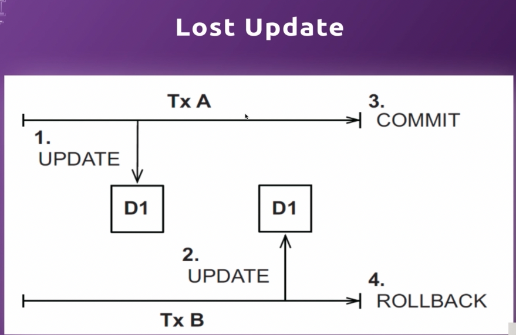
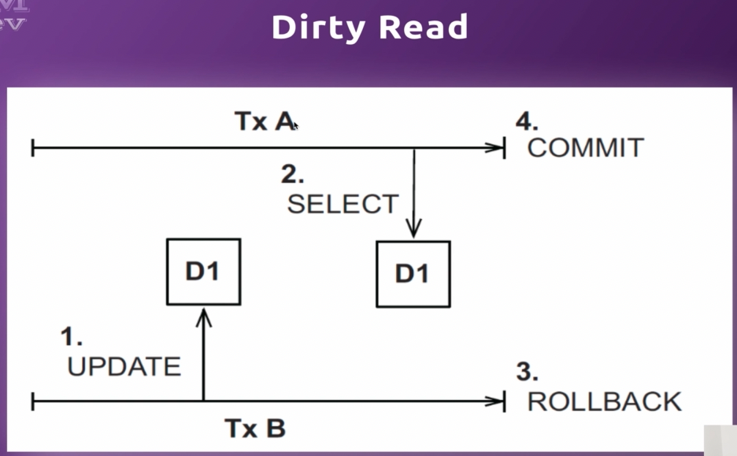
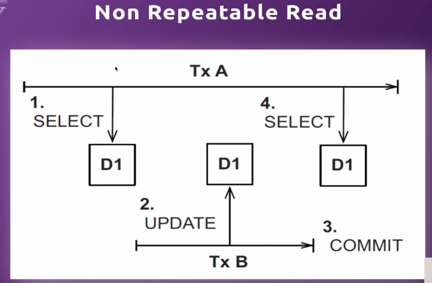
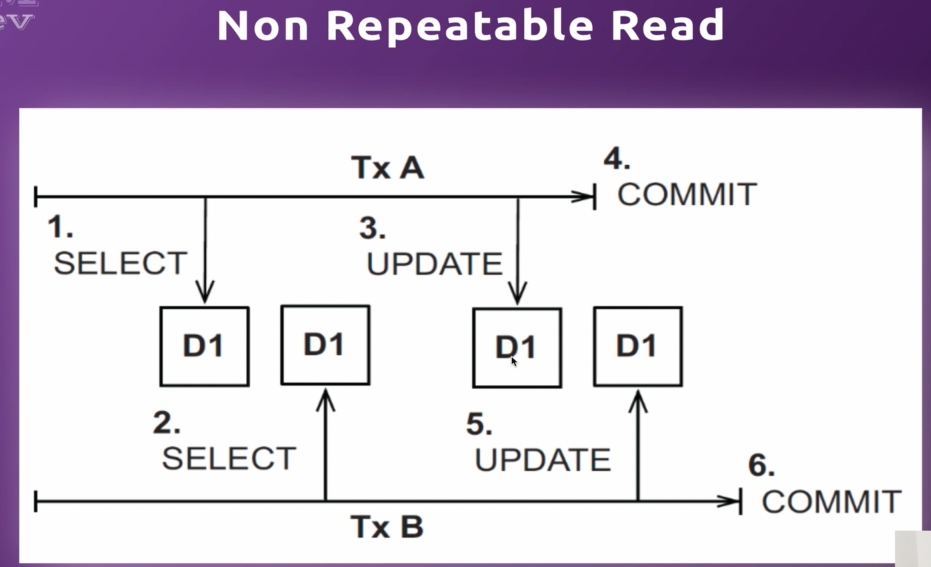
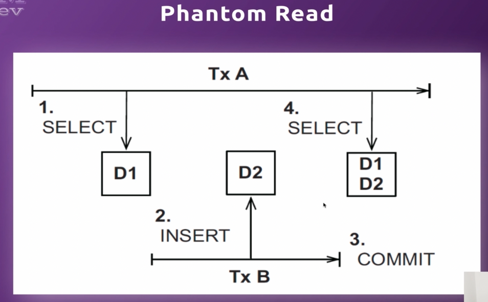
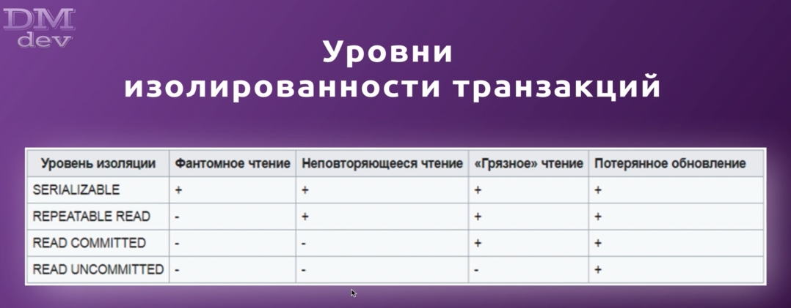
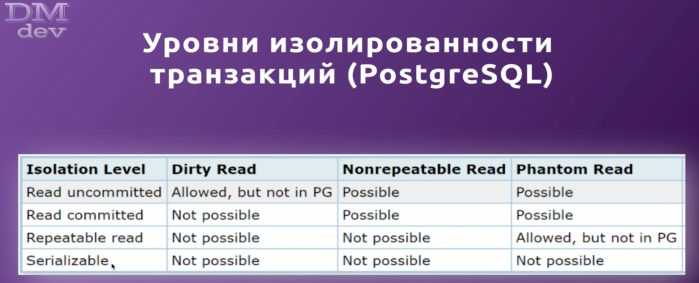

    Транзакция - еденица работы в рамках соединения с БД. Состояния:
    - выполняется полностью (commit)
    - полностью откратывается (rollback)

## Набор свойств, которыми должна обладать транзакция БД - ACID:

    A - Atomicity(Атомарность) - гарантирует, что никакая транзакция не будет зафиксирована в системе частично.
        Будут либо выполнены все ее подоперации, либо выполнено ни одной;

    C - Consistency(Согласованность) - каждая успешная транзакция фиксирует только допустипые результаты 
        (в реляционных БД это соблядается и мы не сможем запушить что-то с нарушением каких-то констрэинтов);

    I - Isolation(Изолированность) - во время выполнения транзакции параллельные транзакции не должны оказывать
        влияние на ее результат;

    D - Durability(Устойчивость) - независимо от проблем на нижних уровнях изменения, сделанные успешно завершенной
        транзакцией, должны остаться сохраненными после возвращения системы в работу;

## Проблемы из-за параллельного выполнения всех этих транзакций:

    Lost Update - потерянное обновление - происходит, когда обе транзакции одновременно обновляют данные и затем вторая
        транзакция откатывает изменения, вследствие чего изменения обеих транзакций теряются;

    Dirty Read - "грязное" чтение - происходит, когда первая транзакция читает изменения, сделанные другой транзакцией 
        но эти изменения еще не были ей закоммичены. После чего вторая транзакция откратывает эти изменения, а первая 
        продолжает работу с грязными данными;

    Non Repeatable Read - неповторяющееся чтение - происходит, когда первая трензакция читает одни и те же данные дважды
        но после первого прочтения вторая транзакция изменяет (update) эти же данные и делвет коммит, вследствие чего 
        вторая выборка в первой трензакции вернет другой результат;

    Существует особый случай Non Repeatable Read называемый last commit wins, когда обе транзакции читают одни и те же
        данные, но первая успевает изменить и закомитить их раньше, чем произойдет изменение и коммит во второй транзакции,
        вследствии чего изменения первой транзакции теряются;

    Phantom Read - фантомное чтение - проиходит, когда первая трензакция читает одни и те же данные дважды, но после 
        первого прочтения вторая транзакция добавляет новые строки или удаляет старые и делает коммит, вследствии чего 
        вторая выборка в первой транзакции вернет другой результат (разное количество записей)

## Уровни изолированности транзакций
    Read Commited - установлен по умолчанию в Hibernate
    Нужно понимать, чем выше мы во изолированности, тем хуже по производительности наше приложение, т.к. мы все больше 
        заставляем его работать в "однопоточности"

## Уровни изолированности транзакций в PosgreSQL
