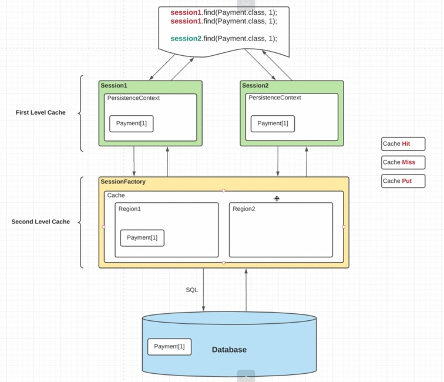

SecondLevelCache - это кэш на уровне sessionFactory

    1 В первой строке у нас miss - ничего не нашли. Получсаем из БД и кладем в кэш. 
    2 Положить в кэш - это put
    3 В строке 2 мы нашли нашу сушность в кэше - hit

## Зависимости

    implementation 'org.hibernate:hibernate-jcache:6.1.5.Final'
    implementation 'org.ehcache:ehcache:3.10.6'

## Хибер конфиг

     <property name="hibernate.cache.use_second_level_cache">true</property>
     <property name="hibernate.cache.region.factory_class">org.hibernate.cache.jcache.internal.JCacheRegionFactory</property>
    