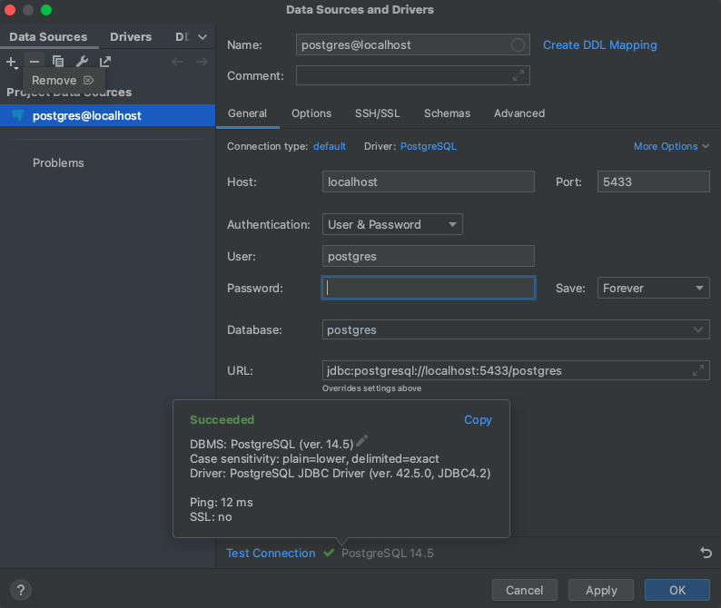

Если в идее, то кликаем "+" и ставим параметры:
    user - postgres (стоял по-умолчанию, когда контейнер поднимали)
    password - pass (поставили сами, когда контейнер поднимали)

Кликаем "Test connection" и если все ок -> apply -> ok

Скрипт на тестовую таблицу

CREATE TABLE users (
    username VARCHAR(128) PRIMARY KEY,
    firstname VARCHAR(128),
    lastname VARCHAR(128),
    birth_date DATE,
    age INT
);

DROP TABLE users;